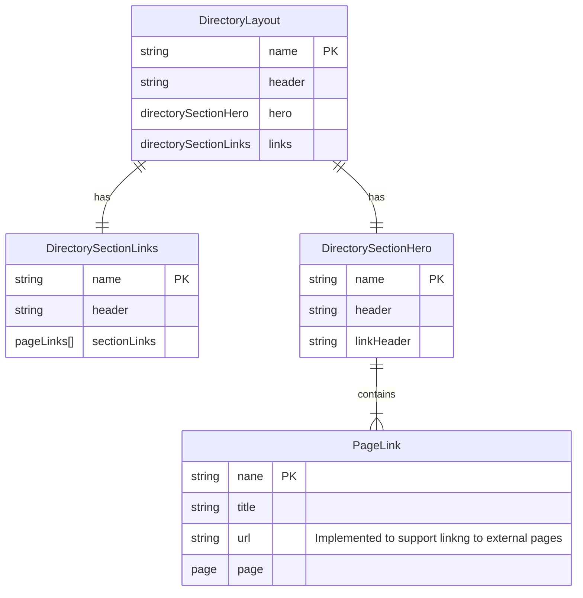

```mermaid
  erDiagram

  DirectoryLayout||--||DirectorySectionLinks: has
  DirectoryLayout||--||DirectorySectionHero: has
  DirectorySectionHero||--|{PageLink: contains
  DirectoryLayout {
    string name PK
    string header
    directorySectionHero hero
    directorySectionLinks links
  }
  DirectorySectionHero {
    string name PK
    string header
    string linkHeader

  }
  DirectorySectionLinks {
    string name PK
    string header
    pageLinks[] sectionLinks
  }
  PageLink {
    string nane PK
    string title
    string url "Implemented to support linkng to external pages"
    page page
  }
```