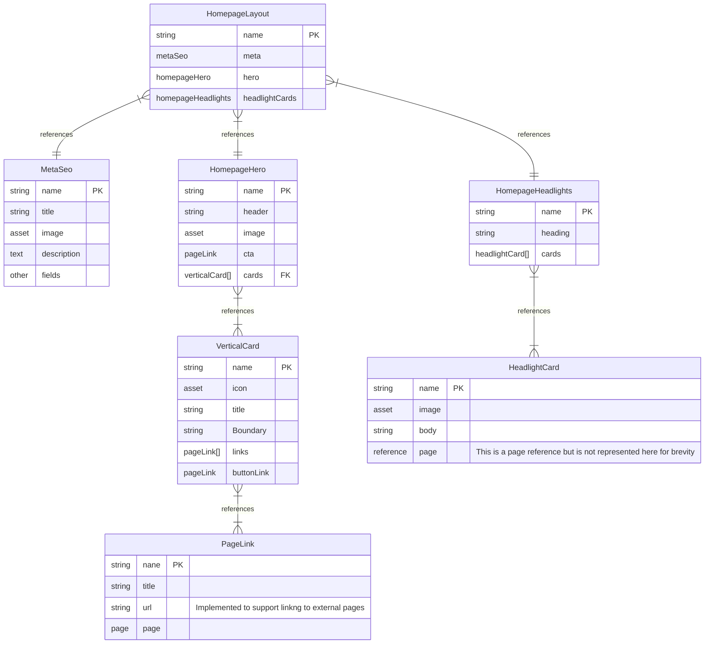

```mermaid
erDiagram
  HomepageLayout {
      string name PK
      metaSeo meta
      homepageHero hero
      homepageHeadlights headlightCards
  }
  HomepageLayout}|--||MetaSeo: references
  HomepageLayout}|--||HomepageHero: references
  HomepageLayout}|--||HomepageHeadlights: references
  HomepageHero}|--|{VerticalCard: references
  VerticalCard}|--|{PageLink: references
  HomepageHeadlights}|--|{HeadlightCard: references
  MetaSeo {
    string name PK
    string title
    asset image
    text description
    other fields
  }
  HomepageHero {
    string name PK
    string header
    asset image
    pageLink cta
    verticalCard[] cards FK
  }
  HomepageHeadlights {
    string name PK
    string heading
    headlightCard[] cards
  }
  VerticalCard {
    string name PK
    asset icon
    string title
    string Boundary
    pageLink[] links
    pageLink buttonLink
  }
  PageLink {
    string nane PK
    string title
    string url "Implemented to support linkng to external pages"
    page page
  }
  HeadlightCard {
    string name PK
    asset image
    string body
    reference page "This is a page reference but is not represented here for brevity"
  }
```
