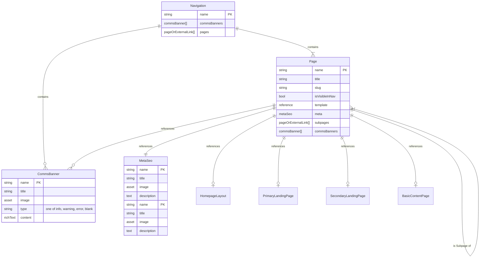

```mermaid
  erDiagram
  Page||--|{Page: "is Subpage of"
  Navigation||--|{Page: contains
  Navigation||--o{CommsBanner: contains
  Page||--||MetaSeo: references
  Page||--o|HomepageLayout: references
  Page||--o|PrimaryLandingPage: references
  Page||--o|SecondaryLandingPage: references
  Page||--o|BasicContentPage: references
  Page||--o{CommsBanner: references
  Navigation {
    string name PK
    commsBanner[] commsBanners
    pageOrExternalLink[] pages
  }
  Page {
    string name PK
    string title
    string slug
    bool isVisibleInNav
    reference template
    metaSeo meta
    pageOrExternalLink[] subpages
    commsBanner[] commsBanners
  }
  MetaSeo {
    string name PK
    string title
    asset image
    text description
  }
  HomepageLayout
  PrimaryLandingPage
  SecondaryLandingPage
  BasicContentPage
  MetaSeo {
    string name PK
    string title
    asset image
    text description
  }
  CommsBanner {
    string name PK
    string title
    asset image
    string type "one of info, warning, error, blank"
    richText content
  }
```
