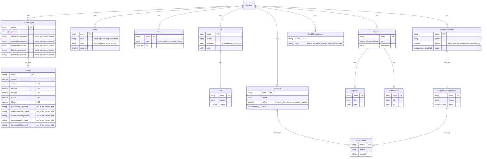

```mermaid
  erDiagram
    RichText||--o{ColumnLayout: has
    ColumnLayout||--|{Column: "has many"
    RichText||--o{Alert: has
    RichText||--o{Button: has
    RichText||--o{Tabs: has
    Tabs||--|{Tab: has
    RichText||--o{Accordion: has
    Accordion||--|{AccordionItem: "has many"
    RichText||--o{TopicLink: has
    TopicLink||--o|PageLink: has
    TopicLink||--o|ExternalLink: has
    RichText||--o{OneOffComponents: has
    RichText||--o{SteppedAccordion: has
    SteppedAccordion||--|{SteppedAccordionStep: "has many"
    SteppedAccordionStep||--|{AccordionItem: "has many"
    RichText
    TopicLink {
      string name PK
      pageLinkOrExternalLink link
      string description
    }
    ColumnLayout {
      string name PK
      column[] columns
      string smVerticalAlignment "one of top, center, bottom"
      string mdVerticalAlignment "one of top, center, bottom"
      string xsVerticalAlignment "one of top, center, bottom"
      string lgVerticalAlignment "one of top, center, bottom"
      string xlVerticalAlignment "one of top, center, bottom"
    }
    Column {
      string name PK
      richText content
      number xsSpan "1-12"
      number smSpan "1-12"
      number mdSpan "1-12"
      number lgSpan "1-12"
      number xlSpan "1-12"
      string xsHorizontalAlignment "one of left, center, right"
      string smHorizontalAlignment "one of left, center, right"
      string mdHorizontalAlignment "one of left, center, right"
      string lgHorizontalAlignment "one of left, center, right"
      string xlHorizontalAlignment "one of left, center, right"
    }
    Alert {
      string name PK
      string level  "one of info, warning, error, blank"
      asset icon "Icon could also be set in code"
      richText content
    }
    Button {
      string name PK
      string style "one of primary, secondary, inline"
      pageLink link
    }
    Tabs {
      string name PK
      string header
      string tabLayout "one of horizontal, vertical"
      tab[] tabs
    }
    Tab {
      string name PK
      string header
      richText content
    }
    Accordion {
      string name PK
      string header
      boolean isMulti "If true, multiple items can be open at once"
      accordionItem[] items
    }
    AccordionItem {
      string name PK
      string header
      richText content
    }
    SteppedAccordion {
      string name PK
      string header
      boolean isMulti "If true, multiple items can be open at once"
      steppedAccordionStep[] steps
    }
    SteppedAccordionStep {
      string name PK
      string header
      accordionItem[] items
    }
     PageLink {
      string name PK
      string title
      page page
    }
    ExternalLink {
      string name PK
      string title
      string url
    }
    OneOffComponents {
      string name PK
      string type "one of paymentCalculator, others to be added"
    }
```
