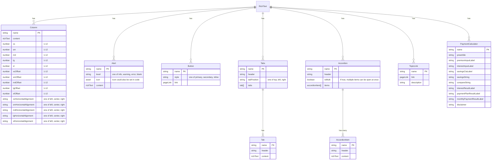

```mermaid
  erDiagram
    RichText||--o{Column: has
    RichText||--o{Alert: has
    RichText||--o{Button: has
    RichText||--o{Tabs: has
    Tabs||--|{Tab: has
    RichText||--o{Accordion: has
    Accordion||--|{AccordionItem: "has many"
    RichText||--o{TopicLink: has
    RichText||--o{PaymentCalculator: has
    RichText
    TopicLink {
      string name PK
      pageLink link
      string description
    }
    Column {
      string name PK
      richText content
      number xs "1-12"
      number sm "1-12"
      number md "1-12"
      number lg "1-12"
      number xl "1-12"
      number xsOffset "1-12"
      number smOffset "1-12"
      number mdOffset "1-12"
      number lgOffset "1-12"
      number xlOffset "1-12"
      string xsHorizontalAlignment "one of left, center, right"
      string smHorizontalAlignment "one of left, center, right"
      string mdHorizontalAlignment "one of left, center, right"
      string lgHorizontalAlignment "one of left, center, right"
      string xlHorizontalAlignment "one of left, center, right"
    }
    Alert {
      string name PK
      string level  "one of info, warning, error, blank"
      asset icon "Icon could also be set in code"
      richText content
    }
    Button {
      string name PK
      string style "one of primary, secondary, inline"
      pageLink link
    }
    Tabs {
      string name PK
      string header
      string tabPosition "one of top, left, right"
      tab[] tabs
    }
    Tab {
      string name PK
      string header
      richText content
    }
    Accordion {
      string name PK
      string header
      boolean isMulti "If true, multiple items can be open at once"
      accordionItem[] items
    }
    AccordionItem {
      string name PK
      string header
      richText content
    }
    PaymentCalculator {
      string name PK
      string preamble
      string premiumInputLabel
      string interestInputLabel
      string savingsCtaLabel
      string savingsString
      string compareString
      string interestResultLabel
      string paymentPlanResultLabel
      string monthlyPaymentResultLabel
      string disclaimer
    }
```
